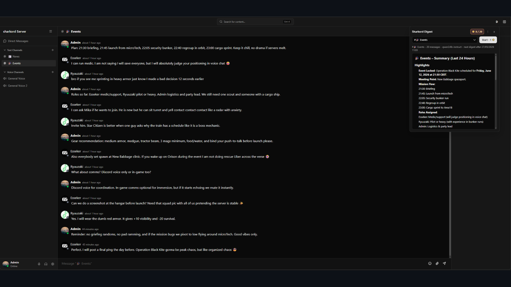
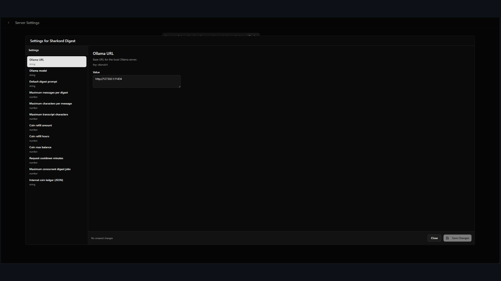

# ✨ Sharkord Digest

> Generate private 24-hour or 24-message recaps for [Sharkord](https://github.com/Sharkord/sharkord)
> text channels with a local Ollama model. Users choose a channel, spend one
> digest coin, and receive the summary in a private panel instead of flooding
> public chat.

[](https://youtu.be/U1nJ_VmeBjs)

---

## 🚀 Features

- 🔒 **Private recaps**: summaries stay in the requester panel, never in public chat.
- ⭐ **Topbar shortcut**: open Sharkord Digest from the Sharkord topbar.
- 🎯 **Smart channel picker**: automatically selects the current text channel, with a dropdown fallback.
- 🔀 **Flexible digest window**: switch between `24H` and `24M` for quiet channels.
- 🧠 **Local AI**: uses Ollama, with `qwen3:4b-instruct` as the default model.
- 🟢 **Ollama status check**: the panel checks the configured Ollama URL when opened.
- 📝 **Readable Markdown**: headings, lists, bold, inline code, and safe links.
- 📚 **Per-channel history**: reread paid digests for each channel for 24 hours.
- 📋 **Copy tools**: copy rendered text, copy Markdown, or regenerate from the menu.
- 🪙 **Digest coins**: per-user quota persisted in plugin settings.
- ⏱️ **Cooldowns and queueing**: protects the host machine from spam and parallel overload.
- 🧵 **Background jobs**: slow local models do not hit Sharkord action timeouts.
- 🔁 **Controlled regen**: costs coins and follows the same request cooldown as Start.

---

## 📦 Install

Install from the Sharkord marketplace when available, or unpack the generated
plugin bundle into your Sharkord plugin folder:

```txt
dist/sharkord-digest
```

For local testing in this repository, the built plugin can be copied to:

```txt
sharkord-server-test/data/plugins/sharkord-digest
```

Restart the Sharkord backend, or disable and re-enable the plugin, after
updating the server bundle.

---

## 🧠 Ollama Setup

Install Ollama, then pull the default model:

```bash
ollama pull qwen3:4b-instruct
```

Default Ollama URL:

```txt
http://127.0.0.1:11434
```

Default model:

```txt
qwen3:4b-instruct
```

The Ollama URL accepts only `http://` and `https://`. Localhost and
`127.0.0.1` are allowed because they are the normal local Ollama setup.

When the Digest panel opens, it checks the configured URL and expects Ollama's
standard `Ollama is running` response. The dot next to the title shows the
result: orange while checking, green for **Ollama Up**, red for **Ollama Down**.
If Ollama is down, Digest actions stay disabled until the panel is closed and
opened again after Ollama is available.

---

## 🕹️ User Flow

Users must have the Sharkord `USE_PLUGINS` permission to see and use the
Digest topbar button. Server owners and admins usually have it already. For
regular members, enable **Use plugins** on the role you want to authorize.

1. Open a text channel in Sharkord.
2. Click the star button in the topbar.
3. Wait for the Ollama status dot to turn green.
4. Confirm or change the selected text channel.
5. Choose `24H` for the selected 24-hour window or `24M` for the last 24 messages, regardless of date.
6. Click `Start - 1` with the coin icon.
7. Follow the live status: queued position, then Ollama preparation.
8. Use the vertical ellipsis menu to copy the result, copy Markdown, regenerate, or delete the local cached result.
9. Switch channels or modes in the dropdown to reread another paid digest from the last 24 hours.

The plugin returns digests only in the private panel for the requester. It does
not post summaries into public channels.



---

## ⚙️ Admin Settings

All settings are managed from Sharkord's plugin settings UI.



To let non-admin users use Sharkord Digest, open the role permissions in
Sharkord and enable **Use plugins** for the roles that should see plugin UI
elements and execute plugin actions. Without this permission, Sharkord hides the
Digest topbar button for that user.

| Setting | Default | Min | Max | Description |
|---|---:|---:|---:|---|
| `ollamaUrl` | `http://127.0.0.1:11434` | 1 char | 2048 chars | Base `http(s)` URL for the local Ollama server |
| `ollamaModel` | `qwen3:4b-instruct` | 1 char | 120 chars | Ollama model used for summaries |
| `defaultPrompt` | bundled English prompt | 1 char | 20000 chars | Editable system prompt sent before messages |
| `maxMessages` | `120` | `1` | `1000` | Sensitive context setting. Maximum recent messages considered for one digest |
| `maxMessageLength` | `500` | `1` | `5000` | Sensitive context setting. Maximum characters kept from each message |
| `maxTranscriptChars` | `24000` | `1000` | `200000` | Sensitive context setting. Total transcript budget sent to Ollama; older messages are excluded first |
| `coinRefillAmount` | `3` | `0` | `100` | Coins added to each user at every refill. Use `0` to disable refills |
| `coinRefillHours` | `24` | `1` | `168` | Refill interval in hours |
| `coinMaxBalance` | `10` | `1` | `1000` | Maximum stored coins per user |
| `requestCooldownMinutes` | `5` | `0` | `1440` | Mandatory delay between accepted Start/Regen jobs. Use `0` to disable cooldown |
| `maxConcurrentDigestJobs` | `1` | `1` | `10` | Maximum Ollama digest jobs running at the same time |
| `coinLedger` | `{}` | valid JSON object | valid JSON object | Internal persisted per-user coin ledger JSON |

If an admin saves an invalid value, Sharkord Digest stays loaded but disables
its user-facing actions. Users only see `This plugin is disabled. Contact
admin.` in the panel; the exact invalid setting is written to plugin logs for
admins. Validation is checked periodically while the plugin is loaded, and the
same invalid state is logged only once to avoid log spam.

`Use 0 to disable` applies only to `coinRefillAmount` and
`requestCooldownMinutes`. `coinMaxBalance` must stay at least `1`.

> ⚠️ **Context settings are sensitive.**
> For `qwen3:4b-instruct`, keep the stock values unless the Ollama host is
> comfortably handling the workload: `maxMessages = 120`,
> `maxMessageLength = 500`, and `maxTranscriptChars = 24000`.
> Raising them can increase latency, RAM/VRAM usage, and timeout risk.

Recommended `maxConcurrentDigestJobs` is `1` for most personal machines. Raise
it only if your Ollama host has enough CPU/GPU/RAM to handle parallel
generation.

In `24H` mode, Sharkord Digest summarizes the selected 24-hour window. In `24M`
mode, it ignores timestamps and takes the last 24 messages in the selected
channel, which is better for quiet channels where people only post occasionally.

If the transcript is too large, older messages are excluded first so the most
recent context is preserved.

---

## 🪙 Coins And Cooldowns

- First use initializes a user to `min(coinRefillAmount, coinMaxBalance)`.
- Refills accumulate over elapsed refill intervals, capped by `coinMaxBalance`.
- The coin badge tooltip shows the next refill amount and countdown, for example `+3 coins in 16h10`.
- If refills are disabled, the tooltip shows `No refill enabled`; if the user is already capped, it shows `Max reached`.
- Start costs 1 coin.
- Regen costs 1 coin.
- Coins are debited immediately when a job is accepted.
- If Ollama fails or times out, the plugin refunds exactly the debited cost.
- The request cooldown stays consumed even on failure, preventing rapid retry loops against Ollama.
- Regen requires a previous digest for the same user, channel, and mode.
- Regen follows `requestCooldownMinutes`; setting it to `0` disables the cooldown for both Start and Regen.
- The trash icon clears only the local cached result shown in the panel. It does not refund coins or delete server history.

The coin ledger is stored in the `coinLedger` plugin setting, so balances
survive a Sharkord server restart as long as the Sharkord data directory and
database are kept. Accepted jobs keep a pending debit marker in the same
ledger; if the server restarts while Ollama is still working, that pending cost
is refunded when the plugin loads again.

---

## ⏳ Ollama Queue

Digest requests are queued globally inside the plugin. By default,
`maxConcurrentDigestJobs = 1`, so only one Ollama request runs at a time and
other accepted jobs wait in line.

Users see their queue position while waiting. Once their job starts running,
the panel switches to the Ollama preparation state.

This protects small machines from several users launching summaries at the same
time. Users are charged when their job is accepted into the queue, not when it
starts running, which prevents double-click and spam races. If the job later
fails, the coin is refunded.

---

## 🔐 Security Notes

- Markdown is rendered with React nodes; the plugin does not use `dangerouslySetInnerHTML`.
- Only `http://` and `https://` markdown links become anchors.
- Rendered links use `target="_blank"` and `rel="noopener noreferrer"`.
- Message history SQL uses parameterized queries.
- Prompt and message payloads are capped to limit local compute abuse.
- Stock context caps are 120 messages, 500 characters per message, and 24,000 transcript characters total.
- Cooldowns, coins, regen limits, and queueing are enforced on the server side.

---

## 🛠️ Development

```bash
bun install
bun link @sharkord/plugin-builder
bun run typecheck
bun test
bun run build
```

The built plugin lands in:

```txt
dist/sharkord-digest
```

---

## ✅ Test Coverage

The test suite covers:

- strict settings validation and disabled-state behavior
- Ollama availability checks
- Sharkord message HTML cleanup
- prompt message formatting
- context caps for per-message truncation and total transcript size
- 24-hour and 24-message digest selection
- 24-hour digest fallback anchored on the latest channel message
- regen cooldown rules
- coin ledger init, refill, cap, debit, refund, and insufficient-balance cases
- request cooldown enabled and disabled states
- failed job refund idempotency and pending-debit recovery
- channel selection helpers
- markdown parsing helpers
- active job resume helpers
- plugin health and Ollama status UI helpers
- copy, loading, and quota UI label helpers
